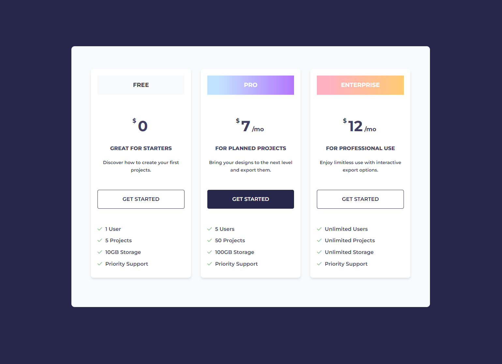

# Pricing Grid HTML Challenge

We have come to our first challenge project. In this challenge, you are going to create the HTML for a pricing grid. Ultimately, the page will look like this:



However, right now we are only focusing on the HTML.

Here is what I want you to create now:


We have 3 pricing cards. A `card` in UI design is a container that holds information. They typically have a border and a shadow to make them stand out. Each card has a heading, price, price info, main text, a button, and a list of features.

Here are the specifics:

- Everything should be wrapped in a `div` with the class of `container`.
- The 3 cards should be wrapped in a parent `div` with the class of `pricing`. This will be used as a flexbox container later, when we get to that.
- Each of the 3 cards should be wrapped in a `div` with the class of `card`.
- The heading should be an `h2` tag.
- The price should be a `p` tag with the class of `price`.
- The price info should be a `p` tag with the class of `price-info`.
- Make the price info text bold with the `strong` tag.
- The main text should be a `p` tag with the class of `main-text`.
- The button should be an `a` tag with the class of `btn`.
- The list of features should in be an `ul` tag.
- Each feature should be an `li` tag.
- The '$' should be wrapped in a `sup` tag.
- The text '/mo' should be wrapped in a `span` tag.

Later on, we will style this page to make it look like the image above.

<details>
  <summary>Click For Solution</summary>
  
```html
<!DOCTYPE html>
<html lang="en">
  <head>
    <meta charset="UTF-8" />
    <meta name="viewport" content="width=device-width, initial-scale=1.0" />
    <title>Pricing</title>
  </head>
  <body>
    <div class="container">
      <div class="pricing">
        <div class="card">
          <h2>Free</h2>
          <p class="price"><sup class="dollar">$</sup>0</p>
          <p class="price-info"><strong>Great For Starters</strong></p>
          <p class="main-text">Discover how to create your first projects.</p>
          <a href="#" class="btn">Get Started</a>
          <ul>
            <li>1 User</li>
            <li>5 Projects</li>
            <li>10GB Storage</li>
            <li>Priority Support</li>
          </ul>
        </div>
        <div class="card">
          <h2>Pro</h2>
          <p class="price">
            <sup>$</sup>7<span>/mo</span>
          </p>
          <p class="price-info"><strong>For Planned Projects</strong></p>
          <p class="main-text">
            Bring your designs to the next level and export them.
          </p>
          <a href="#" class="btn btn-primary">Get Started</a>
          <ul>
            <li>5 Users</li>
            <li>50 Projects</li>
            <li>100GB Storage</li>
            <li>Priority Support</li>
          </ul>
        </div>
        <div class="card">
          <h2>Enterprise</h2>
          <p class="price">
            <sup>$</sup>12<span>/mo</span>
          </p>
          <p class="price-info"><strong>For Professional Use</strong></p>
          <p class="main-text">
            Enjoy limitless use with interactive export options.
          </p>
          <a href="#" class="btn">Get Started</a>
          <ul>
            <li>Unlimited Users</li>
            <li>Unlimited Projects</li>
            <li>Unlimited Storage</li>
            <li>Priority Support</li>
          </ul>
        </div>
      </div>
    </div>
  </body>
</html>
```

</details>
