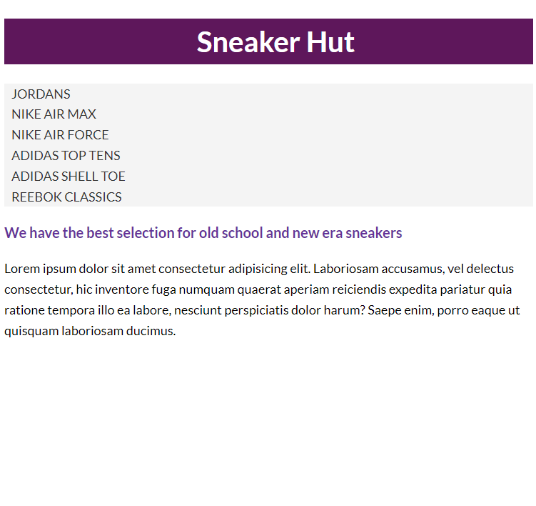

# CSS Basics Challenge

We have a basic HTML layout. We have not gone over enough CSS to have you style this page completely, but I want to see if you can use CSS selectors to add some basic styling to the page. It isn't pretty, but that is ok. It isn't about making it look good, it is about practicing your CSS selectors.

If your CSS is not the exact same, it's ok. As long as you are using CSS selectors to style the page and it looks the same, you are doing it right.

Here is the body for the HTML:

```html
<header class="header">
  <h1>Sneaker Hut</h1>
</header>

<nav>
  <ul class="main-menu">
    <li><a href="#">Jordans</a></li>
    <li><a href="#">Nike Air Max</a></li>
    <li><a href="#">Nike Air Force</a></li>
    <li><a href="#">Adidas Top Tens</a></li>
    <li><a href="#">Adidas Shell Toe</a></li>
    <li><a href="#">Reebok Classics</a></li>
  </ul>
</nav>

<section>
  <p>We have the best selection for old school and new era sneakers</p>

  <p>
    Lorem ipsum dolor sit amet consectetur adipisicing elit. Laboriosam
    accusamus, vel delectus consectetur, hic inventore fuga numquam quaerat
    aperiam reiciendis expedita pariatur quia ratione tempora illo ea labore,
    nesciunt perspiciatis dolor harum? Saepe enim, porro eaque ut quisquam
    laboriosam ducimus.
  </p>
</section>
```

Here are the requirements:

1. Font - Use the `Lato` font from Google Fonts. Add the correct link to the head of the HTML file and the correct font-family to the body.
2. Body - Make body font size `18px` and a line height of` 1.6`.
3. Header - Make the header background color `#5e175b` and the text color white in hexidecimal format (Short version).
4. Header H1 - Align text to `center`, font size `40px` and a text indent of `20px`.
5. Anchor Tags - Remove the underline from all anchor tags and give them a color of `#333`. When hovered over, change the color to `rebeccapurple`. Make the active color `red`.
6. UL - Set the list style type to `none` and give the list a padding of `0`. I know we have not gone over padding yet. It is `padding: 0`.
7. Main Menu - Give the main menu a background color of `#f4f4f4`. Make it all uppercase using the `text-transform` property and text indent of `10px`.
8. Lead Paragraph - Make the font `bold`, a size of `20px` and the color `rebeccapurple`

Here is what it should look like:



<details>
  <summary>Click here for the solution</summary>

Here is the HTML:

```html
<!DOCTYPE html>
<html lang="en">
  <head>
    <meta charset="UTF-8" />
    <meta name="viewport" content="width=device-width, initial-scale=1.0" />
    <link rel="preconnect" href="https://fonts.googleapis.com" />
    <link rel="preconnect" href="https://fonts.gstatic.com" crossorigin />
    <link
      href="https://fonts.googleapis.com/css2?family=Lato:wght@300;400;700&display=swap"
      rel="stylesheet"
    />
    <link rel="stylesheet" href="styles.css" />
    <title>HTML & CSS Sandbox</title>
  </head>
  <body>
    <header class="header">
      <h1>Sneaker Hut</h1>
    </header>

    <nav>
      <ul class="main-menu">
        <li><a href="#">Jordans</a></li>
        <li><a href="#">Nike Air Max</a></li>
        <li><a href="#">Nike Air Force</a></li>
        <li><a href="#">Adidas Top Tens</a></li>
        <li><a href="#">Adidas Shell Toe</a></li>
        <li><a href="#">Reebok Classics</a></li>
      </ul>
    </nav>

    <section>
      <p class="lead">
        We have the best selection for old school and new era sneakers
      </p>

      <p>
        Lorem ipsum dolor sit amet consectetur adipisicing elit. Laboriosam
        accusamus, vel delectus consectetur, hic inventore fuga numquam quaerat
        aperiam reiciendis expedita pariatur quia ratione tempora illo ea
        labore, nesciunt perspiciatis dolor harum? Saepe enim, porro eaque ut
        quisquam laboriosam ducimus.
      </p>
    </section>
  </body>
</html>
```

Here is the CSS:

```css
body {
  font-family: 'Lato', sans-serif;
  font-size: 18px;
  line-height: 1.6;
}

.header {
  background: #5e175b;
  color: #fff;
}

.header h1 {
  text-align: center;
  font-size: 40px;
  text-indent: 20px;
}

a {
  text-decoration: none;
  color: #333;
}

a:hover {
  color: rebeccapurple;
}

a:active {
  color: red;
}

ul {
  list-style: none;
  padding: 0;
}

.main-menu {
  background: #f4f4f4;
  text-transform: uppercase;
  text-indent: 10px;
}

p.lead {
  font-size: 20px;
  color: rebeccapurple;
  font-weight: bold;
}
```
