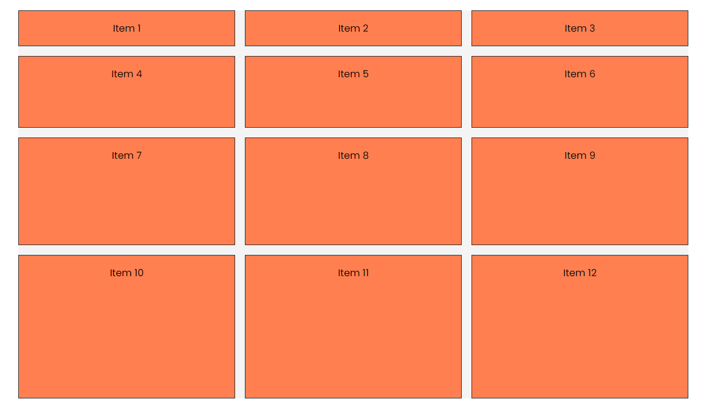

# Grid Challenge 1

We are going to do a little challenge to practice what we have learned so far.

Here is the HTML code:

```html
<div class="container item-grid">
  <div class="item item-1">Item 1</div>
  <div class="item item-2">Item 2</div>
  <div class="item item-3">Item 3</div>
  <div class="item item-4">Item 4</div>
  <div class="item item-5">Item 5</div>
  <div class="item item-6">Item 6</div>
  <div class="item item-7">Item 7</div>
  <div class="item item-8">Item 8</div>
  <div class="item item-9">Item 9</div>
  <div class="item item-10">Item 10</div>
  <div class="item item-11">Item 11</div>
  <div class="item item-12">Item 12</div>
</div>
```

Here is the initial CSS:

```css
body {
  font-family: Arial, sans-serif;
}

.container {
  max-width: 1100px;
  margin: 30px auto;
  background: #f4f4f4;
}

.item {
  background-color: coral;
  padding: 1rem;
  border: 1px solid #333;
  text-align: center;
}

.item-grid {
  /* Your CSS here... */
}
```

We have 12 items in a grid. Your task is to create a grid with 3 columns and 4 rows. The first row should have a height of 1fr, the second 2fr, the third 3fr, and the fourth and everything after that should be 4fr. The columns should have a width of 1fr each. There should be a gap of 1rem between the rows and columns.

It should look like this:



<details>

<summary>Click For Solution</summary>

```css
.item-grid {
  display: grid;
  grid-template-rows: 1fr 2fr 3fr;
  grid-template-columns: repeat(3, 1fr);
  grid-auto-rows: 4fr;
  gap: 1rem;
}
```

</details>
