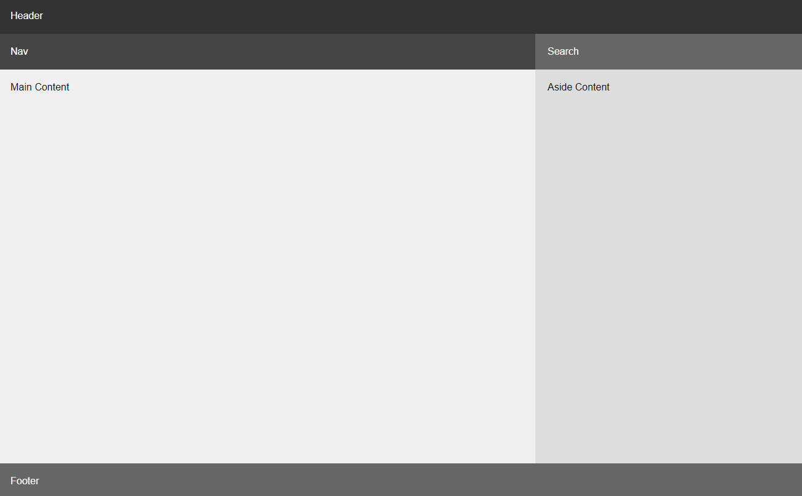

# Grid Challenge 2

In this challenge, you are going to create a layout with a header, nav, search, main content, sidebar and footer. The header will go across the top. The nav and sidebar will be under it side by side. The main content and sidebar will be under the nav and sidebar. The footer will go across the bottom.

Here is the layout:



It doesn't matter if you use the same CSS that I do as long as it looks like this. You really only have to have 2 column spans in the CSS to make this work.

Here is the starter HTML:

```html
<div class="container">
  <header>Header</header>
  <nav>Nav</nav>
  <div class="search">Search</div>
  <main>Main Content</main>
  <aside>Aside Content</aside>
  <footer>Footer</footer>
</div>
```

Here is the starter CSS:

```css
* {
  margin: 0;
  padding: 0;
  box-sizing: border-box;
}

body {
  font-family: Arial, sans-serif;
}

.container {
  display: grid;
  min-height: 100vh;
}

header {
  background-color: #333;
  color: #fff;
  padding: 20px;
}

nav {
  background-color: #444;
  color: #fff;
  padding: 20px;
}

.search {
  background-color: #666;
  color: #fff;
  padding: 20px;
}

main {
  background-color: #f0f0f0;
  padding: 20px;
}

aside {
  background-color: #ddd;
  padding: 20px;
}

footer {
  background-color: #666;
  color: #fff;
  padding: 20px;
}
```

It looks like this to begin with:


I would suggest setting the `grid-template-columns` and `grid-template-rows` first. Then you can use `grid-column` and `grid-row` to span the items that you need.

If you look at the layout, there are 2 columns and 4 rows. Keep that in mind when setting the columns and rows.

<details>
<summary>Click For Solution</summary>

```css
* {
  margin: 0;
  padding: 0;
  box-sizing: border-box;
}

body {
  font-family: 'Poppins', sans-serif;
}

.container {
  display: grid;
  grid-template-columns: 2fr 1fr;
  grid-template-rows: auto auto 1fr auto;
  min-height: 100vh;
}

header {
  background-color: #333;
  color: #fff;
  padding: 20px;
  grid-column: span 2;
}

nav {
  background-color: #444;
  color: #fff;
  padding: 20px;
}

.search {
  background-color: #666;
  color: #fff;
  padding: 20px;
}

main {
  background-color: #f0f0f0;
  padding: 20px;
}

aside {
  background-color: #ddd;
  padding: 20px;
}

footer {
  background-color: #666;
  color: #fff;
  padding: 20px;
  grid-column: span 2;
}
```

</details>
